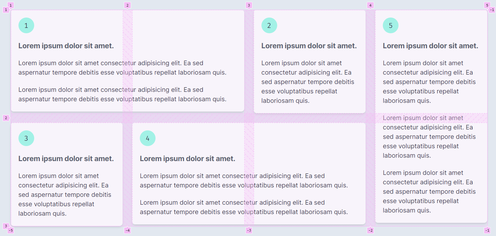
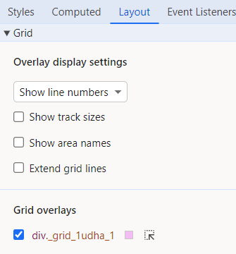

# CSS Grid

Practice CSS Grid. [See demo](https://lightzane.github.io/learn-css-grid/)



In browser dev tools, apply the **Grid overlay** like so:



## Learned

`.grid` (parent class)

- Apply style `display: grid`
- Define how many columns `grid-template-columns: repeat(4, 1fr)`
- All the child elements of `.grid` will be equally distributed to take 100% (`1fr`) of available space

`.grid-items` (child class)

- Opt to resize how much the item would take the space
  - `grid-column: span 2`

See more examples below:

## Vanilla CSS

[See reference](./src/components/grid.module.css)

<!-- prettier-ignore -->
```css
.grid {
    display: grid;
    gap: 1.5rem;
}

/* sm: (apply CSS anything larger than 640px) */
@media (min-width: 640px) {
    .grid {
        /* Basic: grid-template-columns: 1fr 1fr 1fr 1fr; */
        grid-template-columns: repeat(4, 1fr);
        /* 
            1fr 
            - is a unit measure, means we can also use pixels, e.g 100px
            - means a fraction is one part of a whole.
            - 100% of the available space
        */
    }
    
    .grid-item:nth-child(1),
    .grid-item:nth-child(4) {
        /* Span across 2 columns */
        grid-column: span 2;
        /* This is shorthand syntax for:
            grid-column-start: 1; (defaults to current position)
            grid-column-end: 3;

            --or--
            grid-column: 1 / 3;

            --or--
            grid-column: 1 / span 2;
        */
    }

    .grid-item:nth-child(5) {
        grid-column-start: 4;
        grid-row: 1 / span 2;
    }

}
```

## Tailwind CSS

[See reference](./src/components/tailwind-grid.tsx)

```tsx
<div className='grid sm:grid-cols-4 gap-6'>
  {/* 1st */}
  <GridItem id={1} className='sm:col-span-2'>
    <Paragraph />
    <Paragraph />
  </GridItem>

  {/* 2nd */}
  <GridItem id={2}>
    <Paragraph />
  </GridItem>

  {/* 3rd */}
  <GridItem id={3}>
    <Paragraph />
  </GridItem>

  {/* 4th */}
  <GridItem id={4} className='sm:col-span-2'>
    <Paragraph />
    <Paragraph />
  </GridItem>

  {/* 5th */}
  <GridItem id={5} className='sm:col-start-4 sm:row-start-1 sm:row-span-2'>
    <Paragraph />
    <Paragraph />
    <Paragraph />
  </GridItem>
</div>
```


## Other Examples

### Dense Example

See [dense-example.module.css](./src/components/examples/dense-example.module.css)

### Auto column example

See [auto-col-example.module.css](./src/components/examples/auto-col-example.module.css)
